# UD2.AA1. Servei DHCP

0227 Serveis de xarxa

CFGM SMX
Carlos Alonso Martínez

`carlos.martinez@mataro.epiaedu.cat`  v20250805

## Continguts

- Servei DHCP
- Característiques funcionament DHCP
- Configuració client DHCP
- Adreces automàtiques (zero conf)
- Servidor DHCP
- DHCP relay
- Atacs protocol DHCP
- Contramesures

## Servei DHCP (RFC 2131)

- **D**ynamic **H**ost **C**onfiguration **P**rotocol.
- Model client/servidor.
- Assignació als clients dels paràmetres de xarxa:
  - adreça
  - màscara de subxarxa
  - porta d'enllaç
  - servidor de noms

## DHCP vs configuració manual

- Avantatges:
  - **Zero configuracions**  per part dels usuaris.
  - **Minimització errors** a la configuració de xarxa dels equips.
  - **Facilitat de manteniment** : un canvi d’adreça, màscara o DNS es realitza directament al servidor.
  - Permet  **reutilitzar**  adreces (exemple WiFi d'un bar).

- Inconvenient:
  - Cal assegurar el funcionament del servei DHCP (alta disponibilitat).

## Tipus d’assignació

**Estàtica o manual** : l’adreça IP es reserva a un equip concret usant l’adreça MAC del client.

**Dinàmica** : el servidor ofereix una adreça al client per un temps limitat (lease time).

**Permanent** : l’adreça assignada al client queda permanentment associada ( lease time il·limitat). És una solució que permet el protocol però és molt poc utilitzada.

## Detalls del protocol

- Ports:
  - Servidor 67 UDP
  - **Client 68 UDP** 
- El client utilitza un  *well* *kwown*  * port * herència del protocol de [bootstrap](https://es.wikipedia.org/wiki/Protocolo*de*arranque). Es necessita un port conegut perquè el client encara no té configuració i necessita saber a on enviar i a on rebrà els missatges.
- A una mateixa xarxa poden conviure més d’un servidor DHCP.

> Els well known ports són els ports originalment compresos entre el 0 i el 1023 i que l’IANA va reservar per serveis específics, tot i que avui la llista ha anat creixent. Es troben definits a la [RFC 1060](https://datatracker.ietf.org/doc/html/rfc1060)

## Negociació DHCP

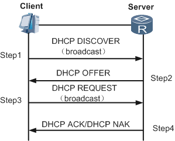

El trànsit de client s’envia per broadcast local per tal d’arribar a tots els possibles servidors.

Les respostes del server s’envien per broadcast perquè el client no té IP encara.

El client utilitza com  **adreça inicial** 0.0.0.0.

El **DHCP offer** s'envia com broadcast.

Per renovar el temps de leasing, el client envia un  **DHCP** **request** per fer el renew de la concessió.

Normalment els clients, envien el renew bastant abans d’acabar el lease time (per exemple, els clients Windows renoven la concessió al 50% del lease time).

## Negociació DHCP i II

Per alliberar l’adreça de la que disposa, el client envia un  **DHCP release** .

El  **DHCP**  **nack** l’envia el servidor per indicar que no li queden adreces lliures o que s’ha produït un error.

El  **DHCP**  **decline** avisa al server que el client ha detectat que l’adreça que se li ha assignat ja està en ús.

## Configuració client

Configurar el client perquè funcioni per DHCP, és molt senzill (per defecte els SO ja ho disposen així).

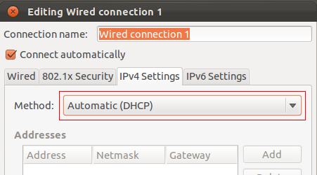

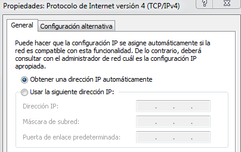

## Configuració client automàtica

- Anem per una situació força habitual:
  - Què passa si el client està configurat per obtenir una adreça de forma automàtica, però no hi ha server DHCP disponible?

És la situació que us podeu trobar si canvieu una VM de NAT a adaptador pont abans d’editar la configuració de xarxa.

## Autoconfiguració: zero conf

La IETF va definir un mètode d’assignació d’adreces privades automàtiques.

APIPA (Automatic Private IP Addressing) és la implementació per Windows o  *Avahi*  en sistemes Linux.

Especifica una adreça aleatòria dins la subxarxa 169.254.0.0/16.

**Només permet connectivitat local!!** 

Les IP duplicades es detecten al moment de la publicació (Gratuitous ARP)

És per això que a una xarxa Windows (grup de treball) el equips es poden comunicar entre sí encara que no s’hagi configurat adreça i no existeixi cap servidor DHCP.

## Servidors DHCP

- Per disposar d’un servidor DHCP a la nostra xarxa disposem de diverses opcions:
  - **Routers** : els routers d’accés a Internet disposen d’un servidor DHCP integrat.
  - **Switch L3** : els switches més avançats també disposen d’aquest servei.
  - **Servidors** : Windows Server i Linux poden oferir també el servei DHCP.

- En un servidor DHCP tindrem les següents opcions:
  - **Marge d’adreces (range  o pool)**: conjunt d’adreces que s’oferiran.
  - **Configuració porta enllaç i servei de noms**.
  - **Temps de concessió** per les assignacions dinàmiques.
  - Llistes per fer assignacions estàtiques.

- Funcions addicionals:
  - **Creació d’àmbits per gestionar diverses xarxes**.
  - **Interfícies per les que accepta peticions DHCP**.
  - **Configuracions avançades**:
    - Configuració de servei horari, proxy, servidors correu...
  - **Configuració DHCP per IPv6**.

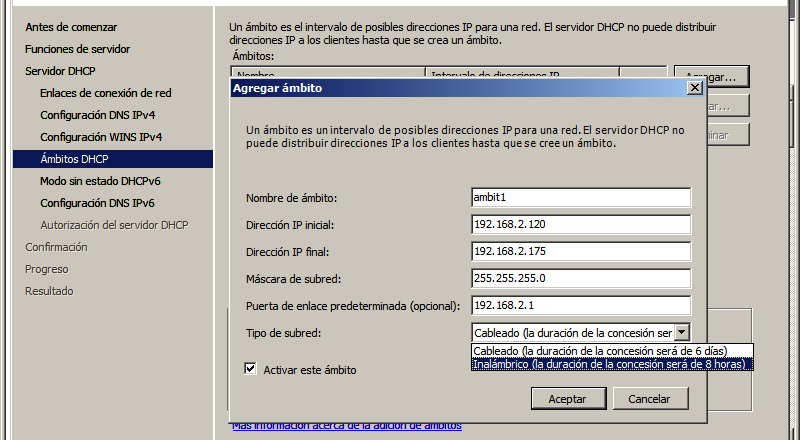

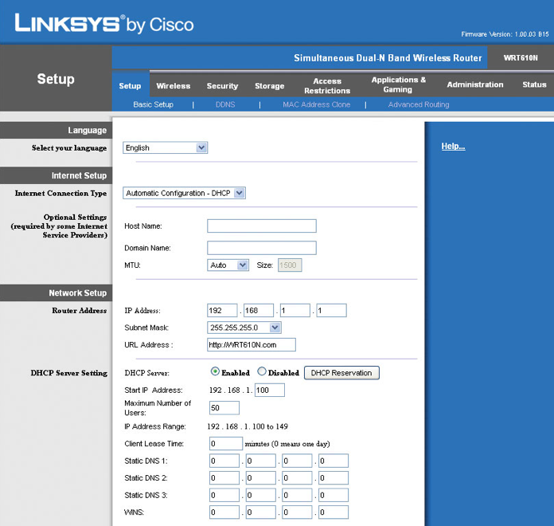

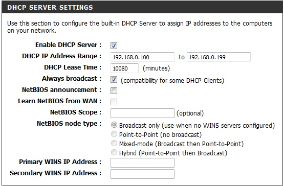

## DHCP relay

És un intermediari que rep les peticions DHCP dels clients i les redirigeix cap el servidor.

Poder usar un sol servidor DHCP per diverses xarxes.

Reducció del trànsit en el segment de xarxa del servidor (les peticions seran unicast enlloc de broadcast).

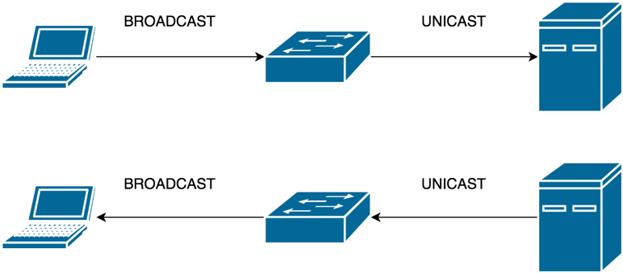

## Atacs protocol DHCP

- El protocol DHCP és sensible a una sèrie d’atacs:
  - DHCP starvation
  - DHCP spoofing
    - DHCP rogue
    - DHCP ACK injection

## DHCP starvation

Inundar de peticions DHCP falses el servidor, de manera que no quedin adreces lliures a la xarxa.

Sol ser el primer pas per fer un atac de DHCP Rogue.

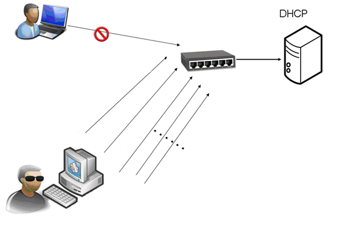

L’atacant llença moltes peticions amb MACs diferents

## DHCP rogue

Servidor il·legítim de DHCP que fem servir per configurar els equips de la xarxa.

L’atacant usa aquesta tècnica per modificar la configuració dels clients: MitM, DNS spoofing.

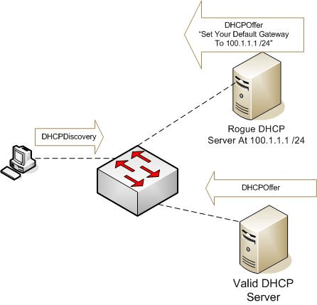

## DHCP ACK injection

Interceptem els paquets request dels clients i enviem el ACK amb la configuració modificada.

El client fa cas al primer ACK rebut.

Funciona si es respon més ràpid que el server.

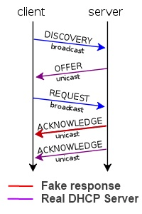

## Contramesures

Eines de monitorització i detecció de servidors de DHCP no autoritzats utilitzant eines d’anàlisi del trànsit com snort, Suricata o similars.

 **DHCP Snooping**: el switch bloqueja els missatges de servidor en els ports marcats con untrusted (tots menys els dels servidor DHCP).

## DHCP Snooping

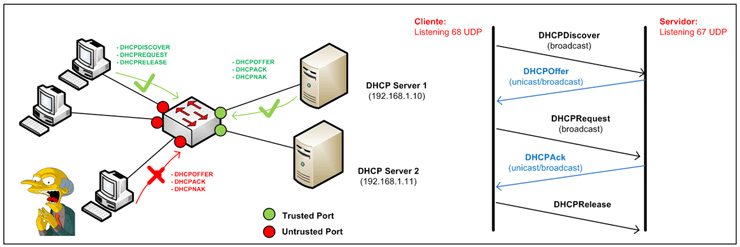

## Autoria i llicenciament

- Aquests materials han estat elaborats per:
  - Carlos Alonso Martínez

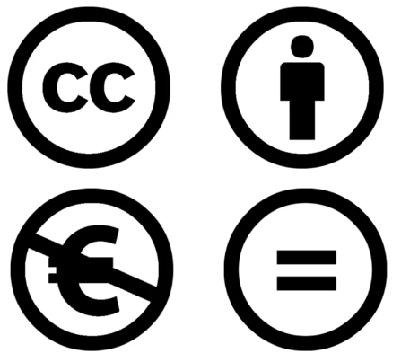

**(CC BY-NC-ND 4.0)**
